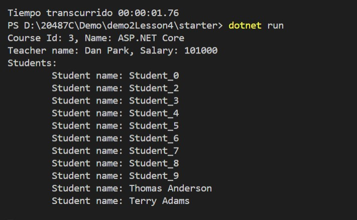

# Module 2: Querying and Manipulating Data Using Entity Framework

# Lesson 4: Manipulating Data

### Demonstration: CRUD Operations in Entity Framework

- Abrimos el proyecto de consola CRUD en Visual Studio Code
- Añadimos el codigo para insertar dos nuevos estudiantes en el main
- Añadimos el codigo para  incrementar el salario de los profesor del curso de ASP.NET Core
- Seleccionamos un estudiante llamado Studen_1
- Guardamos 
- Ejecutar

